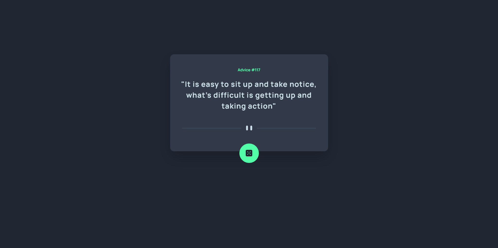

# Frontend Mentor - Advice generator app solution

This is a solution to the [Advice generator app challenge on Frontend Mentor](https://www.frontendmentor.io/challenges/advice-generator-app-QdUG-13db). Frontend Mentor challenges help you improve your coding skills by building realistic projects.

## Table of contents

- [Overview](#overview)
  - [The challenge](#the-challenge)
  - [Screenshot](#screenshot)
  - [Links](#links)
- [My process](#my-process)
  - [Built with](#built-with)
  - [What I learned](#what-i-learned)
  - [Useful resources](#useful-resources)
- [Author](#author)
- [Acknowledgments](#acknowledgments)


## Overview

### The challenge

Users should be able to:
- View the optimal layout for the app depending on their device's screen size
- See hover states for all interactive elements on the page
- Generate a new piece of advice by clicking the dice icon

- 

### Screenshot




### Links

- Solution URL: [Add solution URL here](https://www.frontendmentor.io/solutions/advice-app-generator-using-api-Xaq9n4pYG)
- Live Site URL: [Add live site URL here](https://62212cc82f496254ac975d18--stoic-brown-8b976d.netlify.app/)

## My process

### Built with

- Semantic HTML5 markup
- Flexbox
- Mobile-first workflow
- [Tailwind](https://tailwindcss.com) - CSS library


### What I learned

I learnt how to use Asynchronous programming to get data from a third party API

To see how you can add code snippets, see below:


```js
async function fetchAdvice() {
    const res = await fetch('https://api.adviceslip.com/advice')
    const data = await res.json();
}

```

### Useful resources

- [Advice API](https://api.adviceslip.com/advice) - This is the advice API used.

## Author

- Frontend Mentor - [Richd0tcom](https://www.frontendmentor.io/Richd0tcom)
- Twitter - [Richd0tcom](https://www.twitter.com/0xRICHd0tCom)

**Note: Delete this note and add/remove/edit lines above based on what links you'd like to share.**

## Acknowledgments

This is one goes out to me. I'm proud of how far I've come.
